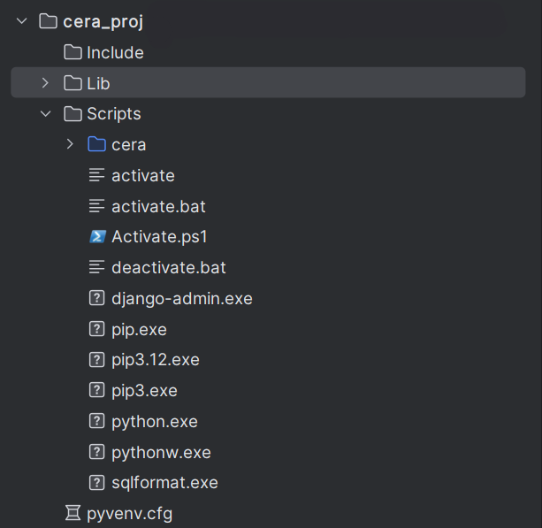

# Django E-commerce Website

An e-commerce platform built with Django featuring product management, shopping cart functionality, and user
authentication.

## Features

- Product catalog with image display
- Product categories and search
- Sale prices and discounts up to 70% off
- Shopping cart functionality
- User authentication and customer profiles
- Pagination for product listings
- Star rating system
- Responsive design
- Order management system
- Shipping address handling

## Prerequisites

- Python 3.12.7
- Conda package manager
- Git
- 
# File Structure


# => Cera should be inside Scripts

## Installation

1. Clone the repository
   ```bash
   git clone https://github.com/yourusername/django-ecommerce.git
   cd django-ecommerce
   ```

2. Create and activate conda environment
   ```bash
   conda create -n ecommerce python=3.12.7
   conda activate ecommerce
   ```

3. Install dependencies
   ```bash
   conda install -c conda-forge --file requirements.txt
   ```

4. Set up the database
   ```bash
   python manage.py makemigrations
   python manage.py migrate
   ```

5. Create superuser (optional)
   ```bash
   python manage.py createsuperuser
   ```

6. Start development server
   ```bash
   python manage.py runserver
   ```

The application will be available at http://127.0.0.1:8000/

